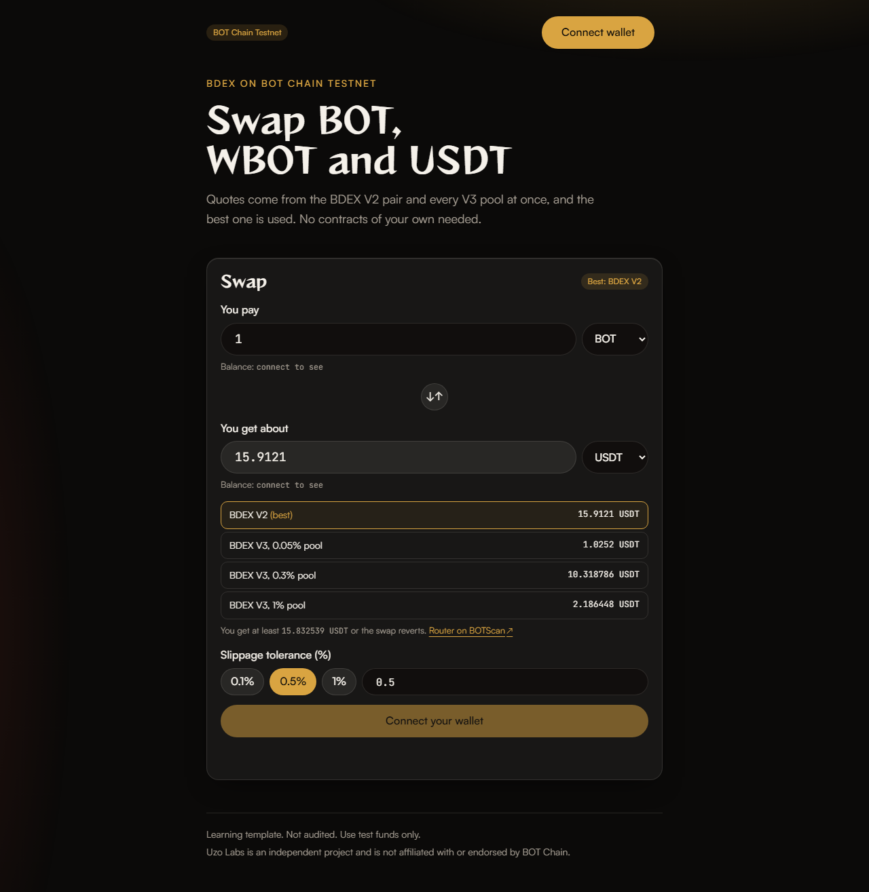

This is a learning template. It has not been audited. Use test funds only unless you know what you are doing.

# DEX integration template for BOT Chain

Find pools, get quotes, wrap BOT and swap on BDEX (BOT Chain's DEX) from the command line, plus a swap widget for the browser. It uses the pools that are already live, so there is nothing to deploy.

**Status: Ready.** Every script and the widget have been run on BOT Chain Testnet (see [Tested on BOTScan testnet](#tested-on-botscan-testnet)).

## What you'll build



- `find-pools`: lists the BDEX V2 pair and the V3 pool for each fee tier (0.01%, 0.05%, 0.3%, 1%) for two tokens, and what each one holds.
- `quote`: prices a swap on every route and marks the best one.
- `wrap`: turns BOT into WBOT and back. WBOT is the ERC-20 version of BOT that pools trade, always worth exactly 1 BOT.
- `swap-v2` and `swap-v3`: approve, then swap, with 0.5% slippage and a 20 minute deadline by default. Both accept native BOT in or out.
- `add-liquidity-v2`: adds to a V2 pair (and creates it if it does not exist yet).
- A swap widget for BOT, WBOT and USDT: live quotes from every route with the best one labelled, a slippage setting, and Approve then Swap buttons.

Every script prints your balances before and after, and a BOTScan link for each transaction.

## Prerequisites

- **Node.js 20.19 or newer** ([download](https://nodejs.org)). Check with `node --version`.
- **A browser wallet** such as MetaMask, for the widget.
- **A fresh test wallet** that holds nothing of value. Export its private key for `.env` (only the scripts that send transactions need it; `find-pools` and `quote` do not).
- **Some tBOT** (testnet BOT). Get 10 free from the [faucet](https://faucet.botchain.ai/basic). A swap costs about 0.003 tBOT of gas, an approval about 0.001 tBOT.

You do not need Foundry or Hardhat. There are no contracts to compile (see [contracts/README.md](./contracts/README.md)).

## Quick start

```bash
npx giget gh:uzolabs/templates/dex-integration my-dex
cd my-dex && npm install
cp .env.example .env
npm run quote
npm run frontend
```

`npm install` also installs the frontend. `npm run quote` needs no key, and prints something like:

```
Quotes for 1 WBOT to USDT on BOT Chain Testnet:

  BDEX V2                  15.9121 USDT  <- best
  BDEX V3, 0.05% pool      1.0252 USDT
  BDEX V3, 0.3% pool       10.318786 USDT
  BDEX V3, 1% pool         2.186448 USDT

With 0.5% slippage you would accept at least 15.832539 USDT.
To swap on the best route: npm run swap-v2 -- 1 WBOT USDT
```

Testnet prices move as people trade, and some pools are much deeper than others, so your numbers will differ.

`npm run frontend` starts the widget at http://localhost:5173. Connect your wallet, and if it asks, click "Switch to BOT Chain Testnet".

### Getting test USDT

There is no USDT faucet. Swap some of your tBOT for it on the live testnet pools:

1. Get 10 tBOT from the [faucet](https://faucet.botchain.ai/basic).
2. Paste your test wallet's key after `PRIVATE_KEY=` in `.env`.
3. Wrap some BOT into WBOT: `npm run wrap -- 1`
4. Swap the WBOT for USDT: `npm run swap-v2 -- 1 WBOT USDT`

Steps 3 and 4 show each part separately. You can also skip the wrap and pay BOT directly with `npm run swap-v2 -- 1 BOT USDT`; the router wraps it for you. In the widget, pick BOT on top and USDT below.

## Verify

There is no contract to verify on BOTScan. Instead, check that the swaps really happened. Find the pools first:

```bash
npm run find-pools
```

Then run a swap. It prints something like the output below, with a BOTScan link for each transaction:

```bash
npm run swap-v2 -- 0.1 BOT USDT
```

```
Before:
  BOT   9.99
  WBOT  0
  USDT  0

Quote:   0.1 BOT gives about 1.59 USDT
Minimum: 1.58 USDT (0.5% slippage). Less than that and the swap reverts.

Swap: waiting for confirmation. https://scan.bohr.life/tx/0x...

After:
  BOT   9.88  (-0.11)
  WBOT  0
  USDT  1.59  (+1.59)
```

The BOT change includes gas. When you swap a token rather than BOT, the script first sends an approval and prints its link too. The other scripts:

```bash
npm run wrap -- 0.5
npm run wrap -- 0.5 --unwrap
npm run swap-v3 -- 0.1 WBOT USDT
npm run swap-v3 -- 1 USDT BOT --fee 3000
npm run add-liquidity-v2 -- 0.1 BOT USDT
```

### Tested on BOTScan testnet

<!-- TESTNET-RESULTS -->
Every script was run against the live BDEX pools on BOT Chain Testnet (chain 968) on 1 October 2026, from one wallet, with the default 0.5% slippage.

**Pools and quotes** (`npm run find-pools`, then `npm run quote -- 0.1 BOT USDT`):

```
Pools for WBOT/USDT on BOT Chain Testnet

BDEX V2
  pair 0xD3EC267707BA234583645E75CE283Cf679dd94Fa
       holds 524.880384895183775641 WBOT and 8517.025298 USDT

BDEX V3
  0.01%  no pool
  0.05%  0xc42db978916872b0c9D4B396e2C8BacC315B3Dac
  0.3%   0xA83dAda88e1d71810dfe89699dCE4d4E589Dd890
  1%     0xe564401644E10B1829e19E1B2b2e6e90be79B631

Quotes for 0.1 BOT to USDT on BOT Chain Testnet:

  BDEX V2                  1.617485 USDT  <- best
  BDEX V3, 0.05% pool      0.102521 USDT
  BDEX V3, 0.3% pool       1.031879 USDT
  BDEX V3, 1% pool         0.218651 USDT
```

**Wrap and swaps.** Each one received exactly the quoted amount:

| Command | Result | Transactions |
| --- | --- | --- |
| `npm run wrap -- 0.1` | 0.1 BOT became 0.1 WBOT | [wrap](https://scan.bohr.life/tx/0x0a145093b9384d07104d36a80768d115def32403d28fa9027b2229671d7b68bf) |
| `npm run swap-v2 -- 0.1 BOT USDT` | +1.617485 USDT | [swap](https://scan.bohr.life/tx/0xdff7cee77fa8032ecdf5f8ec20b95753ee340d08560e96f253dc1085f983893a) |
| `npm run swap-v3 -- 0.1 WBOT USDT` | +1.031879 USDT, through the 0.3% pool | [approve](https://scan.bohr.life/tx/0xfd37b96c7f803a24a467212cc022db508eee5589a018cd2d4844251d82b71fd0), [swap](https://scan.bohr.life/tx/0x7ed077f58274ad7a9a654bf513d5d27c32e164ce2935ee917c93646c39de726f) |
| `npm run swap-v3 -- 1 USDT BOT --fee 3000` | +0.0963 BOT before gas, paid out as BOT, not WBOT | [approve](https://scan.bohr.life/tx/0x8138cdaf18dc2ea495cfa67ccdd5b788dc425c52110476537fc75c5eed8e97b6), [swap](https://scan.bohr.life/tx/0x0016d7609a83cac246fcae20f134a03671bbf33a21eb5a700af35d64a2bd341e) |

```
> npm run swap-v3 -- 1 USDT BOT --fee 3000

Pool:    0.3% fee tier
Quote:   1 USDT gives about 0.096329976186033133 BOT
Minimum: 0.095848326305102967 BOT (0.5% slippage). Less than that and the swap reverts.

Allowance: already enough USDT approved.
Swap: waiting for confirmation. https://scan.bohr.life/tx/0x0016d7609a83cac246fcae20f134a03671bbf33a21eb5a700af35d64a2bd341e

After:
  BOT   9.748059056186033133  (+0.093894276186033133)
  WBOT  0
  USDT  1001.649364  (-1)
```

The first try of that last swap stopped with "HTTP request failed." because the public RPC answered 503 for a short while. The approval had already gone through, so the second try skipped it. The scripts now retry for about 15 seconds before giving up (see [Troubleshooting](#troubleshooting)).

The widget was then used on the same testnet with MetaMask: it quoted every route, sent the swap and showed it confirmed with a BOTScan link.

Pool balances and prices change as people trade, so your numbers will differ.
<!-- /TESTNET-RESULTS -->

## How it works

```
scripts/find-pools.ts          V2 getPair and V3 getPool for each fee tier
scripts/quote.ts               prices every route and marks the best
scripts/wrap.ts                WBOT deposit and withdraw
scripts/swap-v2.ts             approve, then swap through Router02
scripts/swap-v3.ts             approve, then swap through SwapRouter
scripts/add-liquidity-v2.ts    approve both tokens, then addLiquidity
scripts/lib/                   arguments, balances, network selection, mainnet guard, approve and send
frontend/src/dex/              route finding, quoting, slippage maths, transaction building and failure reasons, shared with the scripts
frontend/src/SwapResult.tsx    the window that says whether a transaction worked, and why not if it failed
frontend/                      Vite + React + wagmi swap widget
```

**Addresses.** Every BDEX address (WBOT, USDT, both factories, Router02, SwapRouter, QuoterV2) comes from `getAddresses(chainId)` in `@uzolabs/sdk/contracts`, along with the ABIs. Pool addresses are never stored. Each time a script or the widget runs, it asks the V2 factory (`getPair`) and the V3 factory (`getPool`, once per fee tier) where the pools are.

**BOT and WBOT.** Pools hold ERC-20 tokens, and BOT is not one, so they trade WBOT instead. You can still pay with BOT or receive BOT:

- V2: Router02 has `swapExactETHForTokens` (send BOT as the transaction value) and `swapExactTokensForETH` (receive BOT). "ETH" in these names means the chain's native coin, which is BOT here.
- V3: send BOT as the value to `exactInputSingle` and SwapRouter wraps it. To receive BOT, the script and the widget call `multicall` with two steps in one transaction: `exactInputSingle` sends the WBOT to the router, then `unwrapWETH9` turns it into BOT and sends it to you.
- BOT to WBOT (or back) is not a swap. It goes straight to the WBOT contract (`deposit` and `withdraw`), always 1:1 and with no fee.

**Quotes.** V2 quotes come from Router02's `getAmountsOut`. V3 quotes come from QuoterV2's `quoteExactInputSingle`, which is not a view function: it runs the swap and then reverts with the answer, so it is called with `eth_call` (viem's `simulateContract`). The best route is the one that gives you the most.

**Slippage and deadline.** Prices can move between your quote and your transaction. The minimum you accept is the quote minus your slippage (0.5% by default, at most 5%). If the pool would give you less, the swap reverts and you only lose gas. Each swap also carries a deadline 20 minutes ahead, so a transaction stuck in the mempool cannot fill hours later at a bad price.

**Approvals.** To swap a token (not BOT), the router must be allowed to take it. The scripts and the widget approve the exact amount of the trade, not an unlimited amount, so a bug in the router could never take more than that trade needs. The V2 router and the V3 router each need their own approval.

**USDT has 6 decimals.** BOT and WBOT have 18. Amounts are converted with each token's own decimals (`parseUnits(amount, token.decimals)`), never `parseEther`.

**Network settings.** Chain IDs, RPC URLs and explorer URLs come from `@uzolabs/sdk/chains`. You can point the scripts at a different RPC with `BOT_TESTNET_RPC_URL` or `BOT_MAINNET_RPC_URL` in `.env`.

**The widget.** `frontend/src/wagmi.ts` sets up wagmi with the injected (browser wallet) connector. If you have more than one wallet extension, "Connect wallet" lists them by name (EIP-6963) so you choose which one to use. It uses testnet unless `VITE_CHAIN_ID` in `frontend/.env` is mainnet's ID. `App.tsx` waits until you stop typing for 400 ms, then asks every route for a quote, and refreshes quotes and balances every 15 seconds. The button walks you through each step: connect, switch network, enter an amount, approve, swap. Each transaction shows "confirm in wallet", then "pending" with a BOTScan link, then "confirmed" or a readable error. Status lines sit in an `aria-live` region so screen readers announce them. When a transaction finishes, a window opens with the result. On success it shows what you paid, what you got (your balance after the block minus before it, two plain reads), the route and the gas fee. On failure it says why in plain words, such as you cancelled in your wallet, not enough tBOT for gas, the price moved past your slippage, the deadline passed, or the RPC stopped answering, and what to do next. If the transaction reverted on chain, it replays it on the block before to get the router's reason. `frontend/src/dex/errors.ts` holds these reasons, and `npm test` checks them. It never reads event logs.

**The look.** `frontend/src/theme.css` holds the Uzo Labs design: a dark palette, glass cards, pill buttons and two slow background glows (turned off if you prefer reduced motion). It is plain CSS, so there is no styling dependency. `frontend/src/styles.css` is for styles that belong to the widget only.

## Make it yours

- **Default slippage, maximum slippage, deadline:** edit `DEFAULT_SLIPPAGE_BPS`, `MAX_SLIPPAGE_BPS` and `DEADLINE_MINUTES` in `frontend/src/dex/math.ts`. The scripts and the widget share this file. In basis points, 50 means 0.5%.
- **Slippage for one script run:** add `--slippage 1` for 1%.
- **Pick a V3 pool:** add `--fee 500`, `--fee 3000` or `--fee 10000` to `swap-v3`. Without it, the script uses the pool with the best quote.
- **More tokens:** add them to `getTokens` and `SYMBOLS` in `frontend/src/dex/routes.ts`. Take their addresses from `@uzolabs/sdk/contracts` or an environment variable, and check each one's `decimals()`.
- **Multi-hop routes:** the scripts trade directly between two tokens. For token A to C through B, pass a longer `path` to the V2 router, or use V3's `exactInput` with an encoded path.
- **Exact output ("I want exactly 10 USDT"):** use `swapTokensForExactTokens` on V2 or `exactOutputSingle` on V3, and approve the maximum you are willing to pay.
- **Remove liquidity:** approve the pair's LP token to Router02 and call `removeLiquidity` (or `removeLiquidityETH` to get BOT back).
- **Colours and fonts:** edit the variables at the top of `frontend/src/theme.css`.
- **Embed the widget:** `SwapCard` in `App.tsx` is self-contained. Copy it, `frontend/src/dex/`, and `styles.css` into your own wagmi app.

## Deploying to mainnet

Mainnet uses real BOT and real USDT. This template has not been audited. Trade on mainnet only after you understand the code and have had it reviewed. Check the quote, the minimum received and the router address before you approve anything.

```bash
npm run quote -- 1 BOT USDT --mainnet
npm run swap-v2 -- 1 BOT USDT --mainnet
```

You can also set `MAINNET=true` in `.env`. Every script that sends a transaction shows a warning, says what it is about to do, and waits for you to type `MAINNET`. Anything else cancels, and nothing is sent. It also refuses to run from a script or CI, because there is no one to type the confirmation. `find-pools` and `quote` send nothing, so they do not ask.

For the widget, put `VITE_CHAIN_ID=677` in `frontend/.env`, then run `npm --prefix frontend run build` and host the `frontend/dist` folder anywhere that serves static files. Use a separate wallet for mainnet, and keep its key out of any file you might share.

## Troubleshooting

**"has 0 tBOT, so it cannot pay for gas" or "insufficient funds".** Your wallet needs tBOT for gas. Get 10 tBOT from the [faucet](https://faucet.botchain.ai/basic) (once per address every 24 hours), wait for it to arrive, and try again. Check that the address in the error is the one you funded.

**Wrong network.** If the widget shows "Switch to BOT Chain Testnet", click it and approve in your wallet. If your wallet does not know the network, it will offer to add it. For scripts, the error says which chain the RPC reported. Check `BOT_TESTNET_RPC_URL` in `.env`, or leave it blank to use the default.

**"Could not reach the RPC" or "HTTP request failed".** The public RPC sometimes answers 503 (busy) for a minute or so. The scripts retry for about 15 seconds first, and the error says when the RPC answered with an HTTP status. Wait a minute and run the same command again. A step that already went through, such as an approval, is not repeated. If it keeps failing while the [explorer](https://scan.bohr.life) loads fine, check your VPN, firewall or proxy, and `BOT_TESTNET_RPC_URL` in `.env` (blank uses the default).

**USDT amounts look a million million times too big or too small.** USDT has 6 decimals on BOT Chain, while BOT and WBOT have 18. Convert with `parseUnits(amount, 6)` for USDT, never `parseEther`, or amounts are off by a factor of 10^12. The scripts and the widget read each token's decimals from `getTokens`.

**"Too little received" or `INSUFFICIENT_OUTPUT_AMOUNT`.** The price moved past your slippage before the swap was mined. Nothing was swapped, only gas was spent. Quote again and retry, or raise the slippage a little with `--slippage 1`.

**"No pool can fill this" or "no pool" for a fee tier.** Not every fee tier has a pool. There is no 0.01% WBOT/USDT pool on testnet at the time of writing. Run `npm run find-pools` to see which exist. Some pools hold very little, so a large trade can get a poor price; `npm run quote` shows each route side by side.

**"BOT and WBOT are 1:1 and need no pool".** Use `npm run wrap` (or `npm run wrap -- 1 --unwrap`) to move between them. In the widget, the button says Wrap or Unwrap.

**Verifying the swap.** There is no contract to verify on BOTScan, because this template deploys none. To check a swap, open the BOTScan link the script printed and look at the token transfers. If a link shows "not found", the explorer has not indexed it yet; wait a minute and reload.

**`EXPIRED` (V2) or `Transaction too old` (V3).** More than 20 minutes passed between building the swap and it being mined, usually because the wallet popup was left open. Click Swap again for a fresh deadline.

**`eth_getLogs` is disabled.** BOT Chain's public RPCs do not serve event logs, so `getLogs`, `getContractEvents` and wagmi's `useWatchContractEvent` will not work. This template only uses direct reads (`getPair`, `getPool`, quotes, balances) and polls them. For trade history, link to BOTScan.

**The widget quotes nothing.** Quotes appear about half a second after you stop typing. If they never appear, check the browser console. A blocked or slow RPC is the usual cause; set `VITE_RPC_URL` in `frontend/.env` to another RPC and restart `npm run frontend`.

**"PRIVATE_KEY is not set".** Run `cp .env.example .env` and paste your test wallet key after `PRIVATE_KEY=`. Only `wrap`, the swaps and `add-liquidity-v2` need it.

**`npm install` warns about install scripts (`allow-scripts`).** npm 11 skips some packages' install scripts until you approve them. The template does not need them. You can ignore the warning.

## Resources

- BOT Chain testnet explorer: https://scan.bohr.life
- Testnet faucet: https://faucet.botchain.ai/basic
- `@uzolabs/sdk`: https://www.npmjs.com/package/@uzolabs/sdk
- Uniswap V2 router docs (BDEX V2 follows the same interface): https://docs.uniswap.org/contracts/v2/reference/smart-contracts/router-02
- Uniswap V3 SwapRouter docs (BDEX V3 follows the same interface): https://docs.uniswap.org/contracts/v3/reference/periphery/SwapRouter
- viem docs: https://viem.sh
- wagmi docs: https://wagmi.sh

### Why each dependency is here

| Package | Why |
| --- | --- |
| `@uzolabs/sdk` | BOT Chain chain IDs, RPC and explorer URLs, plus the BDEX addresses and ABIs, so nothing is hard-coded. |
| `viem` | Talks to the chain: reads, quotes, ABI encoding and sending transactions. |
| `tsx` | Runs the TypeScript scripts in `scripts/` (and the tests) without a build step. |
| `typescript` | Type-checks the scripts (`npm run typecheck`) and the widget. |
| `@types/node` | Node type definitions for the scripts. |
| `react` | UI library for the widget. |
| `react-dom` | Renders React in the browser. |
| `wagmi` | React hooks for wallets, reads and transactions. |
| `@tanstack/react-query` | Caching layer that wagmi requires. The widget also uses it to fetch and refresh quotes. |
| `vite` | Dev server and production build for the widget. |
| `@vitejs/plugin-react` | Lets Vite compile React (JSX and fast refresh). |
| `@types/react` | React type definitions. |
| `@types/react-dom` | React DOM type definitions. |

The tests use Node's built-in test runner, so they add no dependency.

Uzo Labs is an independent project and is not affiliated with or endorsed by BOT Chain.
