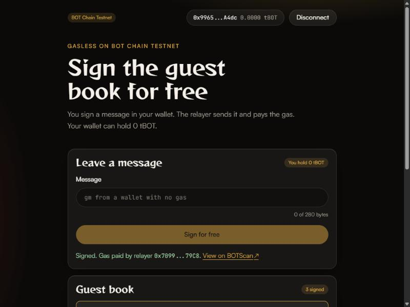

This is a learning template. It has not been audited. Use test funds only unless you know what you are doing.

# Gasless app template for BOT Chain

A guest book on BOT Chain that wallets with 0 tBOT can sign. The user signs a message in their wallet, and a small relayer server sends the transaction and pays the gas. Built on OpenZeppelin's ERC-2771 forwarder, with tests for Foundry and Hardhat 3, a rate-limited relayer, and a web app.

## What you'll build



- `UzoForwarder`, OpenZeppelin's `ERC2771Forwarder` with the name "UzoForwarder". It checks a signed request (signature, nonce, deadline) and passes it on to the target.
- `GuestBook`, an `ERC2771Context` contract with `sign(message)` and `getEntries(offset, limit)`. Each entry records the person who signed it, not the relayer that paid.
- 26 tests that run under both `forge test` and `hardhat test`: direct calls, forwarded calls, expired requests, replays and bad signatures.
- A relayer (`npm run relayer`), a small [Hono](https://hono.dev) server with `POST /relay` and `GET /health`. It only pays for `GuestBook.sign`, checks every request with the forwarder before sending it, and allows 10 requests per signer and per IP address each hour.
- `npm run sign`, which makes a brand new wallet with 0 tBOT and signs the guest book through the relayer, to prove the whole path from the command line.
- A web app: connect a wallet (0 tBOT is fine), type a message, click "Sign for free". The page shows the guest book and "Gas paid by relayer" with a BOTScan link.
- An optional paymaster adapter, off by default (see [How it works](#how-it-works)).

## Prerequisites

- **Node.js 20.19 or newer** ([download](https://nodejs.org)). Check with `node --version`.
- **Foundry** ([install guide](https://getfoundry.sh)). Check with `forge --version`. On Windows, install it from Git Bash or WSL, then open a new terminal.
- **A browser wallet** such as MetaMask, for the web app.
- **Two fresh test wallets** that hold nothing of value:
  - a **deployer**, whose key goes after `PRIVATE_KEY=` in `.env`;
  - a **relayer**, whose key goes after `RELAYER_PRIVATE_KEY=`. Keep it separate from the deployer, because the relayer server holds its key while it runs.
- **Some tBOT** in both. Get 10 free per address from the [faucet](https://faucet.botchain.ai/basic). The deploy uses about 1.46 million gas for both contracts (about 0.03 tBOT at 20 gwei). Each relayed message costs the relayer about 95,000 to 140,000 gas (under 0.003 tBOT), so 1 tBOT pays for roughly 350 messages or more.
- The wallet that **signs** the guest book needs no tBOT at all.

## Quick start

```bash
npx giget gh:uzolabs/templates/gasless-app my-gasless-app
cd my-gasless-app && npm install
cp .env.example .env
npm run deploy
```

Before `npm run deploy`, open `.env` and paste your deployer key after `PRIVATE_KEY=` and your relayer key after `RELAYER_PRIVATE_KEY=`. `npm install` also installs the frontend.

`npm run deploy` compiles, deploys both contracts to testnet, and prints:

```
UzoForwarder deployed on BOT Chain Testnet (chain 968)
  Address:  0x...
  BOTScan:  https://scan.bohr.life/address/0x...
  Tx:       https://scan.bohr.life/tx/0x...
  Saved to: deployments/968.json and frontend/.env

GuestBook deployed on BOT Chain Testnet (chain 968)
  Address:  0x...
  ...

Verify the source code on BOTScan (wait about a minute for the explorer to index it first):
  npm run verify
Next: npm run relayer (in its own terminal), then npm run frontend
```

Start the relayer in its own terminal and leave it running:

```bash
npm run relayer
```

```
Relayer for BOT Chain Testnet (chain 968) listening on http://localhost:8787
  Relayer:   0x... (10 tBOT)
  Forwarder: 0x...
  GuestBook: 0x...
  Paymaster: off (PAYMASTER_URL is blank)
```

Then, in another terminal, start the web app:

```bash
npm run frontend
```

Open http://localhost:5173, connect a wallet that holds 0 tBOT, and if it asks, click "Switch to BOT Chain Testnet". Type a message and click "Sign for free". Your wallet asks for a signature, not a transaction, so there is no gas to approve.

To sign from the command line instead, with a wallet made up on the spot:

```bash
npm run sign -- "gm from the terminal"
```

Prefer Hardhat? Use `npm run deploy:hardhat` and `npm run verify:hardhat` instead. Both toolchains use the same contracts and tests. Restart the relayer after a new deploy, because it reads the addresses when it starts.

## Verify

BOTScan is a [Blockscout](https://www.blockscout.com) explorer, so verification needs no API key. Wait about a minute after deploying, then:

```bash
npm run verify
```

The script verifies both contracts, reading their addresses and constructor arguments from `deployments/968.json`. It prints each command it runs, so you can run them yourself:

```bash
forge verify-contract <forwarder address> contracts/UzoForwarder.sol:UzoForwarder --chain 968 --verifier blockscout --verifier-url https://scan.bohr.life/api/ --watch
forge verify-contract <guest book address> contracts/GuestBook.sol:GuestBook --chain 968 --verifier blockscout --verifier-url https://scan.bohr.life/api/ --watch --constructor-args <abi-encoded forwarder address>
```

With Hardhat (after `npm run deploy:hardhat`):

```bash
npm run verify:hardhat
```

which runs:

```bash
npx hardhat verify blockscout --network botTestnet <forwarder address>
npx hardhat verify blockscout --network botTestnet <guest book address> <forwarder address>
```

Then, with the relayer running, sign from a new wallet:

```bash
npm run sign
```

```
New wallet 0x... holds 0 tBOT
Signed "gm from a wallet with 0 tBOT" (nonce 0, gas ..., valid for 10 minutes)
Posting it to the relayer at http://localhost:8787
Gas paid by relayer. Status: success
  Tx: https://scan.bohr.life/tx/0x...

Newest entry (#0 of 1): "gm from a wallet with 0 tBOT"
  Author: 0x... (the new wallet, not the relayer)
  The new wallet still holds 0 tBOT
```

### Tested on BOTScan testnet

<!-- TESTNET-RESULTS -->
Both toolchains were run against BOT Chain Testnet (chain 968) on 1 October 2026, from the same deployer wallet, with a separate relayer wallet holding 10 tBOT. Each deploy used 1,455,763 gas for both contracts at 20 gwei (0.02911526 tBOT). The four relayed messages below used between 96,439 and 136,073 gas each (under 0.003 tBOT), all paid by the relayer.

**Foundry** (`npm run deploy`, then `npm run verify`, then `npm run relayer` and `npm run sign`):

```
UzoForwarder deployed on BOT Chain Testnet (chain 968)
  Address:  0x5Cdb6F4348B66f6C0f4cA0c8772968AD749d76Eb
  Tx:       https://scan.bohr.life/tx/0xf80d3b363e95102258c8f3be9c4fcefdef410b07dc1b02a2c22213defb849053

GuestBook deployed on BOT Chain Testnet (chain 968)
  Address:  0x4aF0c8bE7D7C43F1cF17Bd421F8f7bE7Bd8927E8
  Tx:       https://scan.bohr.life/tx/0x675ed241e11081a07e94f691f802fed761cfcf918782978a210534e7a7686afa

> forge verify-contract 0x5Cdb6F4348B66f6C0f4cA0c8772968AD749d76Eb contracts/UzoForwarder.sol:UzoForwarder --chain 968 --verifier blockscout --verifier-url https://scan.bohr.life/api/ --watch
Details: `Pass - Verified`
Contract successfully verified

> forge verify-contract 0x4aF0c8bE7D7C43F1cF17Bd421F8f7bE7Bd8927E8 contracts/GuestBook.sol:GuestBook --chain 968 --verifier blockscout --verifier-url https://scan.bohr.life/api/ --watch --constructor-args 0x0000000000000000000000005cdb6f4348b66f6c0f4ca0c8772968ad749d76eb
Details: `Pass - Verified`
Contract successfully verified

Relayer for BOT Chain Testnet (chain 968) listening on http://localhost:8787
  Relayer:   0x2b5D37D93432f25e65BD8bed07cFbc303b72389D (10 tBOT)
  Paymaster: off (PAYMASTER_URL is blank)

New wallet 0x3D46c48BFd76b52F5B1BDF4fE21d1F3ddB8b21f9 holds 0 tBOT
Signed "gm from a wallet with 0 tBOT" (nonce 0, gas 111838, valid for 10 minutes)
Posting it to the relayer at http://localhost:8787
Gas paid by relayer. Status: success
  Tx: https://scan.bohr.life/tx/0x63367813d07788a2d34d469aa84573ef45884b043404f9327ece3a4867add9b2

Newest entry (#0 of 1): "gm from a wallet with 0 tBOT"
  Author: 0x3D46c48BFd76b52F5B1BDF4fE21d1F3ddB8b21f9 (the new wallet, not the relayer)
  The new wallet still holds 0 tBOT
```

Verified source: [UzoForwarder 0x5Cdb...76Eb](https://scan.bohr.life/address/0x5Cdb6F4348B66f6C0f4cA0c8772968AD749d76Eb?tab=contract) and [GuestBook 0x4aF0...27E8](https://scan.bohr.life/address/0x4aF0c8bE7D7C43F1cF17Bd421F8f7bE7Bd8927E8?tab=contract)

**Web app** (`npm run frontend`, with MetaMask on BOT Chain Testnet): a second wallet signed two messages from the page, "gm from a wallet with no gas fee" ([transaction](https://scan.bohr.life/tx/0x7651957887106be231cc898546a4ec36e1570646a3f65fe5ce20572c7ad60d39)) and "Chidile" ([transaction](https://scan.bohr.life/tx/0x694336bb205654af24fcd4412117bf5d1c74f10fb1a7a93faa5ea209fb449fc3)). Both were sent and paid for by the relayer. The wallet's balance and transaction count were the same before and after, and `getEntries` lists it as the author of both.

**Hardhat** (`npm run deploy:hardhat`, then `npm run verify:hardhat`, then the relayer restarted and `npm run sign`):

```
Hardhat Ignition 🚀
Deploying [ GuestBookModule ]
Batch #1
  Executed GuestBookModule#UzoForwarder
Batch #2
  Executed GuestBookModule#GuestBook
[ GuestBookModule ] successfully deployed 🚀

UzoForwarder deployed on BOT Chain Testnet (chain 968)
  Address:  0x9bAb837f41759c737Cb2cC00Ec5D88d5fAcF74C1
  Tx:       https://scan.bohr.life/tx/0x9691b25ddc9d021daaae271f9e8134206aa247177bd2c13a801af84451662d44

GuestBook deployed on BOT Chain Testnet (chain 968)
  Address:  0x7962412A92E5553E66C794c3a352422DEB7BAc27
  Tx:       https://scan.bohr.life/tx/0xf6211b6ab3c6dc0afab431dd9cadde9af6d73bb12672458906fd0666698bfbab

> npx hardhat verify blockscout --network botTestnet 0x9bAb837f41759c737Cb2cC00Ec5D88d5fAcF74C1
✅ Contract verified successfully on BOTScan!

> npx hardhat verify blockscout --network botTestnet 0x7962412A92E5553E66C794c3a352422DEB7BAc27 0x9bAb837f41759c737Cb2cC00Ec5D88d5fAcF74C1
✅ Contract verified successfully on BOTScan!

New wallet 0xCc7EA29b67AfE18Cc6FF7c688b9494e64Ed30dd7 holds 0 tBOT
Signed "gm from a wallet with 0 tBOT" (nonce 0, gas 111838, valid for 10 minutes)
Posting it to the relayer at http://localhost:8787
Gas paid by relayer. Status: success
  Tx: https://scan.bohr.life/tx/0xf6cd7eb36ef3380a50c8e093f14a3e262e65727af5e1ef305806ab6bed2bbc6f

Newest entry (#0 of 1): "gm from a wallet with 0 tBOT"
  Author: 0xCc7EA29b67AfE18Cc6FF7c688b9494e64Ed30dd7 (the new wallet, not the relayer)
  The new wallet still holds 0 tBOT
```

Verified source: [UzoForwarder 0x9bAb...74C1](https://scan.bohr.life/address/0x9bAb837f41759c737Cb2cC00Ec5D88d5fAcF74C1?tab=contract) and [GuestBook 0x7962...Ac27](https://scan.bohr.life/address/0x7962412A92E5553E66C794c3a352422DEB7BAc27?tab=contract)

These addresses are examples from one run. Your deploy gets its own addresses, saved in `deployments/968.json`.
<!-- /TESTNET-RESULTS -->

## How it works

```
contracts/UzoForwarder.sol        OpenZeppelin's ERC2771Forwarder, named "UzoForwarder"
contracts/GuestBook.sol           the guest book, trusts the forwarder
test/GuestBook.t.sol              Solidity tests, run by Foundry and by Hardhat
script/Deploy.s.sol               Foundry deploy script (forwarder, then guest book)
ignition/modules/GuestBook.ts     Hardhat Ignition deploy module
relayer/src/server.ts             starts the relayer: reads .env and the deploy record
relayer/src/app.ts                the HTTP routes, rate limits and CORS
relayer/src/forward.ts            request parsing and the allowlist checks
relayer/src/chain.ts              verify, simulate and send through the forwarder
relayer/src/rate-limit.ts         in-memory sliding window limiter
relayer/src/paymaster.ts          optional paymaster adapter, off by default
relayer/test/app.test.ts          relayer unit tests, no node needed
scripts/deploy.ts                 runs either deployer, then saves the result
scripts/verify.ts                 verifies both contracts with the saved arguments
scripts/sign.ts                   signs from a new 0 tBOT wallet through the relayer
scripts/lib/                      network selection, mainnet guard, Ignition fee hook, helpers
frontend/                         Vite + React + wagmi web app
deployments/<chainId>.json        written by deploy (addresses and constructor args)
```

**The idea.** A normal transaction must be paid for by the account that sends it. With [ERC-2771](https://eips.ethereum.org/EIPS/eip-2771), the user only signs a message (EIP-712 typed data) saying "call `GuestBook.sign("hi")` for me". Anyone can then hand that message to the forwarder in a transaction they pay for. The forwarder checks the signature and calls the guest book with the signer's address added to the end of the calldata. `GuestBook` extends `ERC2771Context`, whose `_msgSender()` reads that address when the caller is the trusted forwarder. So the entry's author is the person who signed, and the relayer only pays.

**The signed request.** The user signs a `ForwardRequest` with these fields: `from`, `to`, `value`, `gas`, `nonce`, `deadline` and `data`. The EIP-712 domain is ("UzoForwarder", "1", chain ID, forwarder address). The app and `npm run sign` read it from the forwarder's `eip712Domain()`, so it always matches. The nonce comes from `forwarder.nonces(signer)` and goes up by one each time a request runs, so a signed request works once only. The deadline is 10 minutes after signing.

**The contracts.** `GuestBook.sign(message)` rejects an empty message (`EmptyMessage`) and anything over 280 bytes (`MessageTooLong`). It stores the author, the block time and the message. `getEntries(offset, limit)` returns a page, oldest first, at most 100 at a time. `entryCount()` says how many there are. The guest book also works without the relayer: calling `sign` directly records you as the author and you pay the gas.

**What the relayer checks before it pays.** `POST /relay` takes `{ "request": { from, to, value, gas, deadline, data, signature } }`, with numbers as decimal strings. In order, it:

1. Refuses bodies over 8 KB, and anything that is not a well-formed request.
2. Refuses any target except the deployed `GuestBook` (403), and any function except `sign(string)` (403).
3. Refuses a `value` other than 0, `gas` above `RELAYER_MAX_GAS` (300,000 by default), a deadline in the past, and a message that is empty or longer than 280 bytes.
4. Counts the request against the signer and against the caller's IP address: 10 each per hour by default. Over the limit it answers 429 with a `Retry-After` header. Rejected requests still count, so nobody can make the relayer call the node for free.
5. Asks the forwarder's own `verify(request)`, which checks the signature, the nonce, the deadline and that the guest book trusts this forwarder.
6. Simulates `execute(request)` and, if it would revert, answers with a plain reason such as "The request has expired. Sign it again."
7. Sends `execute(request)` from the relayer wallet, one transaction at a time so two requests never reuse a nonce, and waits up to 60 seconds for the receipt.

It answers `{ txHash, txUrl, status, paidBy, relayer }`. `GET /health` returns the relayer's address, balance and chain, and whether the paymaster is on. At startup and after each send, the relayer logs a warning when its balance is below `RELAYER_LOW_BALANCE` (1 tBOT by default).

**IP addresses and CORS.** By default the per IP limit uses the connection's address. Set `RELAYER_TRUST_PROXY=true` only when the relayer runs behind your own reverse proxy; then it reads `X-Forwarded-For`, which anyone can fake when there is no proxy. `RELAYER_ALLOWED_ORIGINS` lists the web pages that may call the relayer from a browser. Blank allows any origin. The limits live in memory, so they reset when the relayer restarts.

**The paymaster (optional, off by default).** BOT Chain describes an EOA paymaster flow: ask the paymaster `pm_isSponsorable` about a transaction, and if it says yes, send the same transaction signed with a gas price of 0. `relayer/src/paymaster.ts` implements that, and it is only used when `PAYMASTER_URL` is set in `.env`. No public paymaster for BOT Chain mainnet (chain 677) is confirmed, so it is off by default. It has unit tests but has not been run against a real paymaster. If the paymaster says no or fails, the relayer pays the gas itself, and the web app shows who paid.

**No event logs.** BOT Chain RPCs do not serve `eth_getLogs`. The web app reads `entryCount()`, then `getEntries(count - 20, 20)` for the newest 20 entries, and polls every 10 seconds. `GuestBook` still emits a `Signed` event for explorers, but nothing here depends on it.

**Deploying.** `npm run deploy` checks that the RPC really is the chain you asked for and that your wallet has gas. On mainnet it also asks you to type `MAINNET`. Then it runs `forge script script/Deploy.s.sol` (or `hardhat ignition deploy`), which deploys the forwarder and then the guest book with the forwarder's address. BOT Chain blocks have a base fee of 0, which Ignition reads as free gas, so `scripts/lib/ignition-fees.ts` fills in the fee the RPC asks for. Afterwards the script writes `deployments/968.json`, writes `VITE_CONTRACT_ADDRESS`, `VITE_FORWARDER_ADDRESS`, `VITE_CHAIN_ID` and `VITE_RELAYER_URL` to `frontend/.env`, and refreshes the ABIs in `frontend/src/abi.ts`. It leaves `VITE_RELAYER_URL` alone if you already set it.

**Network settings.** Chain IDs, RPC URLs and explorer URLs come from `@uzolabs/sdk/chains`, not from this code. You can point at a different RPC with `BOT_TESTNET_RPC_URL` or `BOT_MAINNET_RPC_URL` in `.env`. The relayer reads the contract addresses from `deployments/<chainId>.json`, or from `GUESTBOOK_ADDRESS` and `FORWARDER_ADDRESS` if you set them.

**The web app.** `frontend/src/forward.ts` builds the request (domain, nonce, gas estimate, deadline) and posts it to the relayer. `App.tsx` asks the wallet for `eth_signTypedData_v4` only, never a transaction. The sign card walks through "Preparing", "Sign in your wallet", "Relaying", then "Signed. Gas paid by relayer" with a BOTScan link, or a readable error. Your own entries are marked "(you)". A relayer card shows the relayer's address, balance and paymaster setting, and warns when it is offline, low on tBOT or on another chain. Status lines sit in an `aria-live` region so screen readers announce them.

**The look.** `frontend/src/theme.css` holds the Uzo Labs design: a dark palette, glass cards and pill buttons. `frontend/src/styles.css` is for this app only, such as the guest book list.

**Local node.** Set `VITE_RPC_URL` in `frontend/.env` to point the web app at another RPC, for example a local `anvil --chain-id 968`, and set `BOT_TESTNET_RPC_URL` in `.env` for the scripts and relayer. The web app batches reads through Multicall3 at the address in `@uzolabs/sdk`. A fresh anvil has no code there: copy it over with `cast code` from the testnet and `anvil_setCode`.

## Make it yours

- **Your own contract:** make it extend `ERC2771Context`, pass the forwarder's address to its constructor, and use `_msgSender()` everywhere you would use `msg.sender`. Then change the allowlist in `relayer/src/forward.ts` (`SIGN_SELECTOR` and the target check) to the functions you are willing to pay for.
- **Message length:** change `MAX_MESSAGE_LENGTH` in `GuestBook.sol`, `MAX_MESSAGE_BYTES` in `relayer/src/forward.ts` and `MAX_BYTES` in `frontend/src/App.tsx` together.
- **Rate limits:** set `RELAYER_RATE_LIMIT` and `RELAYER_RATE_WINDOW_SECONDS` in `.env`. For several relayer instances, swap the in-memory `RateLimiter` for one backed by a shared store.
- **Who may use it:** add a check in `relayer/src/app.ts`, for example an allowlist of signers, or a login before relaying.
- **Hosting the relayer:** run `npm run relayer` on a server with its own `.env`, set `RELAYER_ALLOWED_ORIGINS` to your site, and set `VITE_RELAYER_URL` in `frontend/.env` to its public URL. Put it behind HTTPS.
- **After changing a contract:** run `npm test`, then `npm run abi` so the web app picks up the change.
- **Colours and fonts:** edit the variables at the top of `frontend/src/theme.css`.

## Deploying to mainnet

Mainnet uses real BOT. This template has not been audited. Deploy to mainnet only after you understand the contracts and the relayer and have had them reviewed. On mainnet the relayer spends real BOT on every message, so anyone who can reach it can cost you money, up to the rate limits.

```bash
npm run deploy -- --mainnet
npm run verify -- --mainnet
npm run relayer -- --mainnet
npm run sign -- --mainnet
```

You can also set `MAINNET=true` in `.env`. Either way the deploy shows a warning and waits for you to type `MAINNET`. Anything else cancels, and nothing is sent. It also refuses to run from a script or CI. Use separate wallets for mainnet, fund the relayer with only what you are willing to spend, keep keys out of any file you might share, and set `RELAYER_ALLOWED_ORIGINS` to your own site.

## Troubleshooting

**"has 0 tBOT, so it cannot pay for gas" or "insufficient funds".** The deployer needs tBOT to deploy, and the relayer needs tBOT to pay for messages. The wallet that signs needs none. Get 10 tBOT from the [faucet](https://faucet.botchain.ai/basic) (once per address every 24 hours) and check that the address in the error is the one you funded.

**"The relayer is low on tBOT".** The relayer's balance is under `RELAYER_LOW_BALANCE`. Send it tBOT from the faucet. Its address is on the relayer card and in the relayer's startup log.

**Wrong network.** If the web app shows "Switch to BOT Chain Testnet", click it and approve in your wallet. If the relayer card says the relayer is on another chain, restart it with the same network as the app (`--mainnet` or not). For scripts, the error says which chain the RPC reported. Check `BOT_TESTNET_RPC_URL` in `.env`, or leave it blank to use the default.

**"Could not reach the relayer".** Start it with `npm run relayer` in its own terminal and leave it running. Check that `VITE_RELAYER_URL` in `frontend/.env` matches the port it prints, then restart `npm run frontend`. If the browser console shows a CORS error, add the page's address (for example `http://localhost:5173`) to `RELAYER_ALLOWED_ORIGINS` in `.env` and restart the relayer.

**"Too many requests. Try again in N minute(s)".** The relayer allows 10 requests per signer and per IP address each hour by default. Wait, or raise `RELAYER_RATE_LIMIT` in `.env` and restart the relayer.

**"The forwarder rejected the signature" or "The request has expired".** The request was already used, was signed for an old nonce, or is more than 10 minutes old. Sign again. If it keeps happening, restart the relayer after a new deploy so it uses the new forwarder.

**"This relayer only pays for calls to the guest book".** The request targets another contract, often because `frontend/.env` and `deployments/968.json` point at different deploys. Run `npm run deploy` again, then restart both the relayer and the frontend.

**USDT has 6 decimals.** This template moves no tokens. If you extend it to accept USDT, which has 6 decimals on BOT Chain, use `parseUnits(amount, 6)`, never `parseEther`, and transfer it with OpenZeppelin's `SafeERC20`. Otherwise amounts are off by a factor of 10^12.

**Verification fails right after deploying.** The explorer needs time to index a new contract. Wait a minute and run `npm run verify` again. It is safe to run more than once. If it says a contract is already verified, that one is done.

**`eth_getLogs` is disabled.** BOT Chain's public RPCs do not serve event logs, so `getLogs`, `getContractEvents` and wagmi's `useWatchContractEvent` will not work. This template reads entries with `entryCount()` and `getEntries()` instead.

**The guest book list stays on "Loading".** The page batches reads through Multicall3. On testnet this works out of the box. On a local node, copy Multicall3 to the address in `@uzolabs/sdk` (see "Local node" above).

**`forge: command not found`.** Install Foundry, then open a new terminal. On Windows, check that `~/.foundry/bin` is on your PATH. In PowerShell you can add it for the current window with `$env:Path += ";$env:USERPROFILE\.foundry\bin"`.

**"PRIVATE_KEY is not set" or "RELAYER_PRIVATE_KEY is not set".** Run `cp .env.example .env` and paste your test wallet keys after `PRIVATE_KEY=` and `RELAYER_PRIVATE_KEY=`.

**The web app says "Deploy the guest book first".** Run `npm run deploy` first, then restart `npm run frontend` so Vite reads the new `frontend/.env`.

**"transaction underpriced: effective gas tip 0" with Hardhat.** Ignition sent a fee of 0. Check that `hardhat.config.ts` still registers the `uzo-ignition-fees` plugin. Nothing is sent when this error appears, so it is safe to run `npm run deploy:hardhat` again.

## Resources

- BOT Chain testnet explorer: https://scan.bohr.life
- Testnet faucet: https://faucet.botchain.ai/basic
- `@uzolabs/sdk`: https://www.npmjs.com/package/@uzolabs/sdk
- ERC-2771 standard: https://eips.ethereum.org/EIPS/eip-2771
- EIP-712 typed data: https://eips.ethereum.org/EIPS/eip-712
- OpenZeppelin meta-transaction docs: https://docs.openzeppelin.com/contracts/5.x/api/metatx
- Hono docs: https://hono.dev
- Foundry book: https://getfoundry.sh
- Hardhat 3 docs: https://hardhat.org/docs
- wagmi docs: https://wagmi.sh

### Why each dependency is here

| Package | Why |
| --- | --- |
| `@openzeppelin/contracts` | Audited `ERC2771Forwarder` and `ERC2771Context` that the forwarder and guest book are built from. |
| `@uzolabs/sdk` | BOT Chain chain IDs, RPC and explorer URLs and the Multicall3 address, so nothing is hard-coded. |
| `viem` | Talks to the chain from the scripts, the relayer and the web app (reads, EIP-712 signing, sending). |
| `hono` | The relayer's small HTTP framework: routes, CORS and the body size limit. |
| `@hono/node-server` | Runs the Hono app on Node and gives the caller's IP address for the rate limit. |
| `hardhat` | The Hardhat 3 toolchain: compile, test, deploy, verify. |
| `@nomicfoundation/hardhat-toolbox-viem` | Hardhat's standard plugin bundle: Solidity tests, viem, and `hardhat verify`. |
| `@nomicfoundation/hardhat-ignition` | Provides `buildModule` for the Ignition deploy module. |
| `forge-std` | Foundry's test and script library (`Test`, `Script`, cheatcodes), installed with npm instead of a git submodule. Pinned to a GitHub tag because the npm copy is out of date. |
| `tsx` | Runs the TypeScript scripts and the relayer without a build step, and runs the relayer tests. |
| `typescript` | Type-checks the scripts and the relayer (`npm run typecheck`). |
| `@types/node` | Node type definitions for the scripts and the relayer. |
| `react` | UI library for the web app. |
| `react-dom` | Renders React in the browser. |
| `wagmi` | React hooks for wallets, reads and typed-data signing. |
| `@tanstack/react-query` | Caching layer that wagmi requires, also used to poll the relayer's `/health`. |
| `vite` | Dev server and production build for the web app. |
| `@vitejs/plugin-react` | Lets Vite compile React (JSX and fast refresh). |
| `@types/react` | React type definitions. |
| `@types/react-dom` | React DOM type definitions. |

The relayer's rate limiter and the paymaster adapter use only Node built-ins (`Map` and `fetch`), and the relayer tests use Node's built-in `node:test`.

Uzo Labs is an independent project and is not affiliated with or endorsed by BOT Chain.
