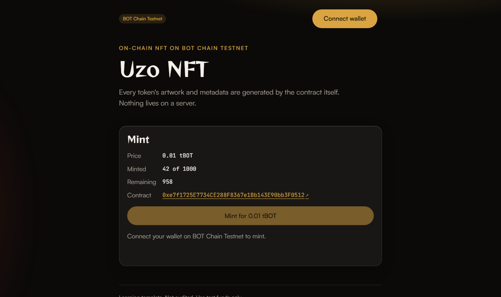

This is a learning template. It has not been audited. Use test funds only unless you know what you are doing.

# NFT template for BOT Chain

An ERC-721 collection for BOT Chain whose artwork and metadata are generated by the contract itself, with tests, deploy, verify and mint scripts for both Foundry and Hardhat 3, and a web app to mint and view your NFTs.

## What you'll build



- `UzoNFT`, an ERC-721 with a fixed maximum supply and a mint price paid in BOT. Anyone can mint by paying exactly the price.
- Fully on-chain metadata: `tokenURI` returns Base64 JSON with an SVG image. Each token gets its own colour from its ID and shows its number. No server, no IPFS.
- 28 tests, including fuzz tests and a reentrancy test, that run under both `forge test` and `hardhat test`.
- One-command deploy, verify on BOTScan, and mint from the command line.
- A web app with a mint button that shows the price and remaining supply, a "My NFTs" gallery, and a withdraw button for the owner.

## Prerequisites

- **Node.js 20.19 or newer** ([download](https://nodejs.org)). Check with `node --version`.
- **Foundry** ([install guide](https://getfoundry.sh)). Check with `forge --version`. On Windows, install it from Git Bash or WSL, then open a new terminal.
- **A browser wallet** such as MetaMask, for the web app.
- **A fresh test wallet** that holds nothing of value. Export its private key for `.env`.
- **Some tBOT** (testnet gas). Get 10 free from the [faucet](https://faucet.botchain.ai/basic). A deploy uses about 2.1 million gas (about 0.04 tBOT at 20 gwei). Each mint costs the mint price (0.01 tBOT by default) plus about 0.003 tBOT of gas.

## Quick start

```bash
npx giget gh:uzolabs/templates/nft my-nft
cd my-nft && npm install
cp .env.example .env
npm run deploy
npm run frontend
```

Before `npm run deploy`, open `.env` and paste your test wallet's key after `PRIVATE_KEY=`. `npm install` also installs the frontend.

`npm run deploy` compiles, deploys to testnet, and then prints:

```
UzoNFT deployed on BOT Chain Testnet (chain 968)
  Address:  0x...
  BOTScan:  https://scan.bohr.life/address/0x...
  Tx:       https://scan.bohr.life/tx/0x...
  Saved to: deployments/968.json and frontend/.env

Verify the source code on BOTScan (wait about a minute for the explorer to index it first):
  npm run verify
```

`npm run frontend` starts the web app at http://localhost:5173. Connect your wallet, and if it asks, click "Switch to BOT Chain Testnet". Then click "Mint for 0.01 tBOT".

To mint from the command line instead:

```bash
npm run mint
```

Prefer Hardhat? Use `npm run deploy:hardhat` and `npm run verify:hardhat` instead. Both toolchains use the same contract and tests.

## Verify

BOTScan is a [Blockscout](https://www.blockscout.com) explorer, so verification needs no API key. Wait about a minute after deploying, then:

```bash
npm run verify
```

The script reads the address and constructor arguments from `deployments/968.json` and prints the exact command it runs, so you can run it yourself:

```bash
forge verify-contract <address> contracts/UzoNFT.sol:UzoNFT --chain 968 --verifier blockscout --verifier-url https://scan.bohr.life/api/ --watch --constructor-args <abi-encoded args>
```

With Hardhat (after `npm run deploy:hardhat`):

```bash
npm run verify:hardhat
```

which runs:

```bash
npx hardhat verify blockscout --network botTestnet <address> "Uzo NFT" UZONFT 10000000000000000 1000 <owner address>
```

Then mint one and check it on BOTScan:

```bash
npm run mint
```

```
Before: you hold 0 NFT(s) and 9.95 tBOT. Minted 0 of 1000.
Mint price: 0.01 tBOT
Minting 1 of 1. Waiting for confirmation: https://scan.bohr.life/tx/0x...
After : you hold 1 NFT(s) and 9.94 tBOT. Minted 1 of 1000.

Newest token: Uzo NFT #1 (hue 127)
  Image: an SVG of 614 characters, stored on chain
  View:  https://scan.bohr.life/token/0x.../instance/1
```

### Tested on BOTScan testnet

<!-- TESTNET-RESULTS -->
Both toolchains were run against BOT Chain Testnet (chain 968) on 1 October 2026, from the same deployer wallet, with the default settings: "Uzo NFT" (UZONFT), 0.01 tBOT per mint, at most 1000. Each deploy used 2,061,513 gas at 20 gwei (0.04123026 tBOT), and each mint used 146,530 gas plus the 0.01 tBOT price.

**Foundry** (`npm run deploy`, then `npm run verify`, then `npm run mint`):

```
UzoNFT deployed on BOT Chain Testnet (chain 968)
  Address:  0x0E766cb54e2E0E30C8f274fc1a7f65d2f53975B1
  Tx:       https://scan.bohr.life/tx/0xd30790293a452b0daf3824aa6bb9978cd5837b3b1debe7dd49d4d98c7de38b33

> forge verify-contract 0x0E766cb54e2E0E30C8f274fc1a7f65d2f53975B1 contracts/UzoNFT.sol:UzoNFT --chain 968 --verifier blockscout --verifier-url https://scan.bohr.life/api/ --watch --constructor-args 0x...
Submitted contract for verification:
        Response: `OK`
Contract verification status:
Response: `OK`
Details: `Pass - Verified`
Contract successfully verified

Before: you hold 0 NFT(s) and 9.91502666 tBOT. Minted 0 of 1000.
Mint price: 0.01 tBOT
Minting 1 of 1. Waiting for confirmation: https://scan.bohr.life/tx/0x1c193f64c7117644c8df7e68a8f5ff9b8a7195b2dd50dcd8eae63ffd47b23e09
After : you hold 1 NFT(s) and 9.90209606 tBOT. Minted 1 of 1000.

Newest token: Uzo NFT #1 (hue 198)
  Image: an SVG of 614 characters, stored on chain
```

Verified source: [0x0E76...75B1 on BOTScan](https://scan.bohr.life/address/0x0E766cb54e2E0E30C8f274fc1a7f65d2f53975B1?tab=contract)

**Hardhat** (`npm run deploy:hardhat`, then `npm run verify:hardhat`):

```
Hardhat Ignition 🚀
Deploying [ UzoNFTModule ]
Batch #1
  Executed UzoNFTModule#UzoNFT
[ UzoNFTModule ] successfully deployed 🚀

UzoNFT deployed on BOT Chain Testnet (chain 968)
  Address:  0x1f92495A787eD4Eee427602236264a8b0B802547
  Tx:       https://scan.bohr.life/tx/0x8d6b9e00d5ccbc298edb2240652c4c85f4c5c78746948b923e5464a747890812

> npx hardhat verify blockscout --network botTestnet 0x1f92495A787eD4Eee427602236264a8b0B802547 "Uzo NFT" UZONFT 10000000000000000 1000 0xe3e5D9f7eD994A6b5f697e60218a29F3Bf98B485
📤 Submitted source code for verification on BOTScan:
  contracts/UzoNFT.sol:UzoNFT
⏳ Waiting for verification result...
✅ Contract verified successfully on BOTScan!
```

Verified source: [0x1f92...2547 on BOTScan](https://scan.bohr.life/address/0x1f92495A787eD4Eee427602236264a8b0B802547?tab=contract)

**Web app** (`npm run frontend`, with MetaMask on BOT Chain Testnet): a second wallet minted token #1 of the Hardhat deploy from the mint page ([transaction](https://scan.bohr.life/tx/0x1a13714a1eccecae0c6e6b05c220b8999428a539fffa4899cd419738e2d09abf)). The page showed "Confirmed", the supply moved to 1 of 1000, and the token appeared in the "My NFTs" gallery and in the wallet.

These addresses are examples from one run. Your deploy gets its own address, saved in `deployments/968.json`.
<!-- /TESTNET-RESULTS -->

## How it works

```
contracts/UzoNFT.sol          the NFT collection
test/UzoNFT.t.sol             Solidity tests, run by Foundry and by Hardhat
script/Deploy.s.sol           Foundry deploy script
ignition/modules/UzoNFT.ts    Hardhat Ignition deploy module
scripts/deploy.ts             runs either deployer, then saves the result
scripts/verify.ts             runs either verifier with the saved arguments
scripts/mint.ts               mints from the command line and decodes the new token
scripts/upload-metadata.ts    optional: pins a token's metadata to IPFS with Pinata
scripts/lib/                  network selection, mainnet guard, Ignition fee hook, helpers
frontend/                     Vite + React + wagmi web app
deployments/<chainId>.json    written by deploy (addresses and constructor args)
```

**The contract.** `UzoNFT` combines OpenZeppelin's `ERC721`, `ERC721Enumerable` (look up tokens by index), `Ownable` and `ReentrancyGuard`. The constructor takes `(name, symbol, mintPrice, maxSupply, owner)`. The deploy scripts make the deployer the owner.

- `mint()` is payable. It reverts with `WrongPayment` unless you send exactly `mintPrice`, and with `SoldOut` once `maxSupply` tokens exist. Token IDs start at 1 and count up.
- `withdraw()` sends the whole balance to the owner. `setMintPrice(newPrice)` changes the price. Both are owner only.
- Both functions that move value are `nonReentrant` and update state before any external call (checks, effects, interactions). Withdraw uses a low-level `call`, so an owner that is a contract wallet still gets paid.

**On-chain metadata.** `tokenURI(id)` builds the metadata when you call it. It hashes the token ID to pick a hue from 0 to 359, draws a 400 by 400 SVG with a gradient in that hue and the text `#id`, then wraps it as Base64 JSON:

```json
{
  "name": "Uzo NFT #7",
  "description": "...",
  "image": "data:image/svg+xml;base64,...",
  "attributes": [{ "trait_type": "Hue", "value": 291 }]
}
```

The result is `data:application/json;base64,...`, which wallets, explorers and marketplaces understand. Nothing is stored per token beyond its owner, so minting stays cheap.

**Finding your NFTs without event logs.** BOT Chain RPCs do not serve `eth_getLogs`, so the usual "scan Transfer events" approach does not work. `ERC721Enumerable` solves this: the app reads `balanceOf(you)`, then `tokenOfOwnerByIndex(you, i)` for each index, then `tokenURI(id)` for each token. All of these are batched reads through Multicall3. The gallery shows the first 48.

**Deploying.** `npm run deploy` checks that the RPC really is the chain you asked for and that your wallet has gas. On mainnet it also asks you to type `MAINNET`. Then it runs `forge script script/Deploy.s.sol` (or `hardhat ignition deploy`). BOT Chain blocks have a base fee of 0, which Ignition reads as free gas, so it would send a fee of 0 and the node would reject it. `scripts/lib/ignition-fees.ts` is a Hardhat network hook that fills in the fee the RPC asks for (20 gwei on testnet). Foundry gets this right on its own. Afterwards it confirms there is code at the new address, writes `deployments/968.json`, writes `VITE_CONTRACT_ADDRESS` and `VITE_CHAIN_ID` to `frontend/.env`, and refreshes the ABI in `frontend/src/abi.ts`.

**Network settings.** Chain IDs, RPC URLs and explorer URLs come from `@uzolabs/sdk/chains`, not from this code. You can point at a different RPC with `BOT_TESTNET_RPC_URL` or `BOT_MAINNET_RPC_URL` in `.env`.

**The web app.** `frontend/src/wagmi.ts` sets up wagmi with the injected (browser wallet) connector. If you have more than one wallet extension, "Connect wallet" lists them by name (EIP-6963) so you choose which one to use. `App.tsx` reads the name, price, supply, max supply and owner in one batched call, and polls every 10 seconds. Each transaction shows "confirm in wallet", then "pending" with a BOTScan link, then "confirmed" or a readable error such as `WrongPayment` or `SoldOut`. Status lines sit in an `aria-live` region so screen readers announce them. The gallery shows images with ``, which never runs scripts inside an SVG, and it only accepts `data:image/svg+xml` images.

**The look.** `frontend/src/theme.css` holds the Uzo Labs design: a dark palette, glass cards, pill buttons and two slow background glows (turned off if you prefer reduced motion). It is plain CSS, so there is no styling dependency. `frontend/src/styles.css` is for styles that belong to this app only, such as the gallery grid.

**Local node.** Set `VITE_RPC_URL` in `frontend/.env` to point the web app at a different RPC, for example a local `anvil --chain-id 968`. The node needs Multicall3 at the usual address, because the batched reads go through it. A fresh anvil does not have it: copy it over with `cast code` from the testnet and `anvil_setCode`.

**Pinning to IPFS (optional, off by default).** This contract does not need IPFS. `scripts/upload-metadata.ts` is a starting point if you change `tokenURI` to point at IPFS instead, for example to use photos that are too large to store on chain. Create a JWT at [Pinata](https://app.pinata.cloud/developers/api-keys), set `PINATA_JWT` in `.env`, and run `npm run upload-metadata -- 1`. It pins token 1's SVG, then a copy of its JSON pointing at the pinned image, and prints both `ipfs://` links. Without `PINATA_JWT` it does nothing. This script has been checked for its error handling but not yet run with a real Pinata account.

## Make it yours

- **Name, symbol, price, supply:** set `NFT_NAME`, `NFT_SYMBOL`, `NFT_MINT_PRICE` (in BOT, for example `0.05`) and `NFT_MAX_SUPPLY` in `.env`, then deploy again. The deploy script passes the price to Foundry in wei as `NFT_MINT_PRICE_WEI`; you do not need to set that yourself.
- **Artwork:** edit `_svg` in `contracts/UzoNFT.sol`. Keep it small, because every byte costs gas to deploy, and use single quotes inside the SVG so it stays valid JSON. Run `npm test` afterwards; the tests decode the JSON and SVG for you.
- **More traits:** add entries to the `attributes` array in `tokenURI`.
- **Free mint:** deploy with `NFT_MINT_PRICE=0`.
- **Limit per wallet:** add a `mapping(address => uint256) minted` and a check in `mint()`.
- **Royalties:** add OpenZeppelin's `ERC2981` and call `_setDefaultRoyalty` in the constructor.
- **After changing the contract:** run `npm test`, then `npm run abi` so the web app picks up the new functions.
- **Colours and fonts:** edit the variables at the top of `frontend/src/theme.css`.
- **Hand over ownership:** call `transferOwnership(newOwner)`, ideally to a multisig wallet. The new owner receives future withdrawals.

## Deploying to mainnet

Mainnet uses real BOT. This template has not been audited. Deploy to mainnet only after you understand the contract and have had it reviewed.

```bash
npm run deploy -- --mainnet
npm run verify -- --mainnet
npm run mint -- --mainnet
```

You can also set `MAINNET=true` in `.env`. Either way the script shows a warning and waits for you to type `MAINNET`. Anything else cancels, and nothing is sent. It also refuses to run from a script or CI, because there is no one to type the confirmation. Use a separate wallet for mainnet, keep its key out of any file you might share, and check the owner address and mint price before you deploy. `maxSupply` cannot be changed after deploy.

## Troubleshooting

**"has 0 tBOT, so it cannot pay for gas" or "insufficient funds".** Your wallet needs tBOT for gas and for the mint price. Get 10 tBOT from the [faucet](https://faucet.botchain.ai/basic) (once per address every 24 hours), wait for it to arrive, and try again. Check that the address in the error is the one you funded.

**Wrong network.** If the web app shows "Switch to BOT Chain Testnet", click it and approve in your wallet. If your wallet does not know the network, it will offer to add it. For scripts, the error says which chain the RPC reported. Check `BOT_TESTNET_RPC_URL` in `.env`, or leave it blank to use the default.

**"Could not reach the RPC" or "HTTP request failed".** The public RPC sometimes answers 503 (busy) for a minute or so. The scripts retry for about 15 seconds first, and the error says when the RPC answered with an HTTP status. Wait a minute and run the same command again. If it keeps failing while the [explorer](https://scan.bohr.life) loads fine, check your VPN, firewall or proxy, and `BOT_TESTNET_RPC_URL` in `.env` (blank uses the default).

**`WrongPayment` when minting.** You must send exactly `mintPrice`, not more. The owner may have changed the price since the page loaded; reload and try again. The mint script always reads the current price first.

**USDT has 6 decimals.** This template is priced in BOT (18 decimals). If you change it to charge USDT, which has 6 decimals on BOT Chain, use `parseUnits(amount, 6)`, never `parseEther`, and transfer it with OpenZeppelin's `SafeERC20`. Otherwise amounts are off by a factor of 10^12.

**Verification fails right after deploying.** The explorer needs time to index a new contract. Wait a minute and run `npm run verify` again. It is safe to run more than once. If it says the contract is already verified, you are done.

**`eth_getLogs` is disabled.** BOT Chain's public RPCs do not serve event logs, so `getLogs`, `getContractEvents` and wagmi's `useWatchContractEvent` will not work. This template finds your tokens with `ERC721Enumerable` reads instead. For transfer history, link to BOTScan.

**The gallery is empty after minting.** It refreshes as soon as the mint confirms, and every 10 seconds after that. If it still shows nothing, check that your wallet is on the same network and account you minted from.

**`forge: command not found`.** Install Foundry, then open a new terminal. On Windows, check that `~/.foundry/bin` is on your PATH. In PowerShell you can add it for the current window with `$env:Path += ";$env:USERPROFILE\.foundry\bin"`. Run `npm` commands from the `nft` folder, not from the Foundry folder.

**"PRIVATE_KEY is not set".** Run `cp .env.example .env` and paste your test wallet key after `PRIVATE_KEY=`.

**The web app says "Deploy your collection first".** Run `npm run deploy` first, then restart `npm run frontend` so Vite reads the new `frontend/.env`.

**"transaction underpriced: effective gas tip 0" with Hardhat.** Ignition sent a fee of 0. Check that `hardhat.config.ts` still registers the `uzo-ignition-fees` plugin; it fills in the fee BOT Chain wants. Nothing is sent when this error appears, so it is safe to run `npm run deploy:hardhat` again.

**`npm install` warns about install scripts (`allow-scripts`).** npm 11 skips some packages' install scripts until you approve them. The template does not need them. You can ignore the warning.

## Resources

- BOT Chain testnet explorer: https://scan.bohr.life
- Testnet faucet: https://faucet.botchain.ai/basic
- `@uzolabs/sdk`: https://www.npmjs.com/package/@uzolabs/sdk
- OpenZeppelin ERC-721 docs: https://docs.openzeppelin.com/contracts/5.x/erc721
- ERC-721 standard: https://eips.ethereum.org/EIPS/eip-721
- Foundry book: https://getfoundry.sh
- Hardhat 3 docs: https://hardhat.org/docs
- wagmi docs: https://wagmi.sh
- Pinata docs (optional IPFS script): https://docs.pinata.cloud

### Why each dependency is here

| Package | Why |
| --- | --- |
| `@openzeppelin/contracts` | Audited ERC721, ERC721Enumerable, Ownable, ReentrancyGuard, Base64 and Strings that the collection is built from. |
| `@uzolabs/sdk` | BOT Chain chain IDs, RPC and explorer URLs, so nothing is hard-coded. |
| `viem` | Talks to the chain from the Node scripts (reads, mints, ABI encoding). |
| `hardhat` | The Hardhat 3 toolchain: compile, test, deploy, verify. |
| `@nomicfoundation/hardhat-toolbox-viem` | Hardhat's standard plugin bundle: Solidity tests, viem, and `hardhat verify`. |
| `@nomicfoundation/hardhat-ignition` | Provides `buildModule` for the Ignition deploy module. |
| `forge-std` | Foundry's test and script library (`Test`, `Script`, cheatcodes), installed with npm instead of a git submodule. Pinned to a GitHub tag because the npm copy is out of date. |
| `tsx` | Runs the TypeScript scripts in `scripts/` without a build step. |
| `typescript` | Type-checks the scripts (`npm run typecheck`). |
| `@types/node` | Node type definitions for the scripts. |
| `react` | UI library for the web app. |
| `react-dom` | Renders React in the browser. |
| `wagmi` | React hooks for wallets, reads and transactions. |
| `@tanstack/react-query` | Caching layer that wagmi requires. |
| `vite` | Dev server and production build for the web app. |
| `@vitejs/plugin-react` | Lets Vite compile React (JSX and fast refresh). |
| `@types/react` | React type definitions. |
| `@types/react-dom` | React DOM type definitions. |

The optional IPFS script uses Node's built-in `fetch` and `FormData`, so Pinata adds no dependency.

Uzo Labs is an independent project and is not affiliated with or endorsed by BOT Chain.
