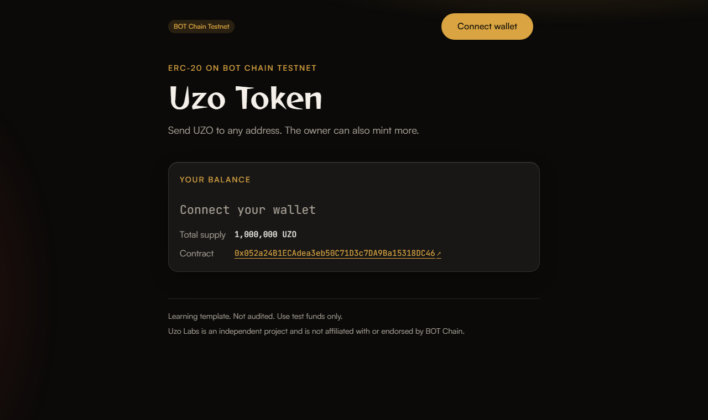

This is a learning template. It has not been audited. Use test funds only unless you know what you are doing.

# Token template for BOT Chain

An ERC-20 token for BOT Chain, with tests, deploy and verify scripts for both Foundry and Hardhat 3, and a small web app to send and mint it.

## What you'll build



- `UzoToken`, an ERC-20 with 18 decimals, [EIP-2612 permit](https://eips.ethereum.org/EIPS/eip-2612) (gasless approvals by signature) and an owner who can mint more.
- 18 tests, including a fuzz test and permit tests, that run under both `forge test` and `hardhat test`.
- One-command deploy and verify on BOTScan with either toolchain.
- A web app that shows your balance and lets you send tokens. The mint form only appears for the owner.

## Prerequisites

- **Node.js 20.19 or newer** ([download](https://nodejs.org)). Check with `node --version`.
- **Foundry** ([install guide](https://getfoundry.sh)). Check with `forge --version`. On Windows, install it from Git Bash or WSL, then open a new terminal.
- **A browser wallet** such as MetaMask, for the web app.
- **A fresh test wallet** that holds nothing of value. Export its private key for `.env`.
- **Some tBOT** (testnet gas). Get 10 free from the [faucet](https://faucet.botchain.ai/basic). A deploy costs well under 0.01 tBOT.

## Quick start

```bash
npx giget gh:uzolabs/templates/token my-token
cd my-token && npm install
cp .env.example .env
npm run deploy
npm run frontend
```

Before `npm run deploy`, open `.env` and paste your test wallet's key after `PRIVATE_KEY=`. `npm install` also installs the frontend.

`npm run deploy` compiles, deploys to testnet, and then prints:

```
UzoToken deployed on BOT Chain Testnet (chain 968)
  Address:  0x...
  BOTScan:  https://scan.bohr.life/address/0x...
  Tx:       https://scan.bohr.life/tx/0x...
  Saved to: deployments/968.json and frontend/.env

Verify the source code on BOTScan (wait about a minute for the explorer to index it first):
  npm run verify
```

`npm run frontend` starts the web app at http://localhost:5173. Connect your wallet, and if it asks, click "Switch to BOT Chain Testnet".

Prefer Hardhat? Use `npm run deploy:hardhat` and `npm run verify:hardhat` instead. Both toolchains use the same contract and tests.

## Verify

BOTScan is a [Blockscout](https://www.blockscout.com) explorer, so verification needs no API key. Wait about a minute after deploying, then:

```bash
npm run verify
```

The script reads the address and constructor arguments from `deployments/968.json` and prints the exact command it runs, so you can run it yourself:

```bash
forge verify-contract <address> contracts/UzoToken.sol:UzoToken --chain 968 --verifier blockscout --verifier-url https://scan.bohr.life/api/ --watch --constructor-args <abi-encoded args>
```

With Hardhat (after `npm run deploy:hardhat`):

```bash
npm run verify:hardhat
```

which runs:

```bash
npx hardhat verify blockscout --network botTestnet <address> "Uzo Token" UZO 1000000000000000000000000 <owner address>
```

### Tested on BOTScan testnet

<!-- TESTNET-RESULTS -->
Both toolchains were run against BOT Chain Testnet (chain 968) on 1 October 2026, from the same deployer wallet, with the default settings: "Uzo Token" (UZO), 1,000,000 tokens to the deployer. Each deploy used 1,093,577 gas at 20 gwei (0.02187154 tBOT).

**Foundry** (`npm run deploy`, then `npm run verify`):

```
UzoToken deployed on BOT Chain Testnet (chain 968)
  Address:  0xd757C1B8410DDFa84F5Ba9AD9f9F7580Bf958561
  Tx:       https://scan.bohr.life/tx/0x0bc3fbe06e36ffce38d2230df5b77ecffc086c627251a71148480e65666ad993

> forge verify-contract 0xd757C1B8410DDFa84F5Ba9AD9f9F7580Bf958561 contracts/UzoToken.sol:UzoToken --chain 968 --verifier blockscout --verifier-url https://scan.bohr.life/api/ --watch --constructor-args 0x...
Submitted contract for verification:
        Response: `OK`
        GUID: `d757c1b8410ddfa84f5ba9ad9f9f7580bf9585616abe110d`
Contract verification status:
Response: `OK`
Details: `Pass - Verified`
Contract successfully verified
```

Verified source: [0xd757...8561 on BOTScan](https://scan.bohr.life/address/0xd757C1B8410DDFa84F5Ba9AD9f9F7580Bf958561?tab=contract)

**Hardhat** (`npm run deploy:hardhat`, then `npm run verify:hardhat`):

```
Hardhat Ignition 🚀
Deploying [ UzoTokenModule ]
Batch #1
  Executed UzoTokenModule#UzoToken
[ UzoTokenModule ] successfully deployed 🚀

UzoToken deployed on BOT Chain Testnet (chain 968)
  Address:  0x052a24B1ECAdea3eb50C71D3c7DA9Ba15318DC46
  Tx:       https://scan.bohr.life/tx/0xd601ba94752856f60dda54453dbd22f13a489416ab58a0a56309602e06fbf9e3

> npx hardhat verify blockscout --network botTestnet 0x052a24B1ECAdea3eb50C71D3c7DA9Ba15318DC46 "Uzo Token" UZO 1000000000000000000000000 0xe3e5D9f7eD994A6b5f697e60218a29F3Bf98B485
📤 Submitted source code for verification on BOTScan:
  contracts/UzoToken.sol:UzoToken
⏳ Waiting for verification result...
✅ Contract verified successfully on BOTScan!
```

Verified source: [0x052a...DC46 on BOTScan](https://scan.bohr.life/address/0x052a24B1ECAdea3eb50C71D3c7DA9Ba15318DC46?tab=contract)

These addresses are examples from one run. Your deploy gets its own address, saved in `deployments/968.json`.
<!-- /TESTNET-RESULTS -->

## How it works

```
contracts/UzoToken.sol        the token
test/UzoToken.t.sol           Solidity tests, run by Foundry and by Hardhat
script/Deploy.s.sol           Foundry deploy script
ignition/modules/UzoToken.ts  Hardhat Ignition deploy module
scripts/deploy.ts             runs either deployer, then saves the result
scripts/verify.ts             runs either verifier with the saved arguments
scripts/transfer.ts           sends tokens from the command line
scripts/lib/                  network selection, mainnet guard, Ignition fee hook, helpers
frontend/                     Vite + React + wagmi web app
deployments/<chainId>.json    written by deploy (addresses and constructor args)
```

**The contract.** `UzoToken` combines three OpenZeppelin building blocks: `ERC20` (balances and transfers), `ERC20Permit` (approve by signature) and `Ownable` (one owner who can call `mint`). The constructor takes `(name, symbol, initialSupply, owner)` and mints the initial supply to the owner. The deploy scripts make the deployer the owner.

**Two toolchains, one project.** `foundry.toml` and `hardhat.config.ts` both point at `contracts/` and `test/`, and both compile with Solidity 0.8.28 for the `cancun` EVM. Foundry resolves imports through `remappings.txt`; Hardhat resolves them from `node_modules`. OpenZeppelin and forge-std are installed with npm, so there are no git submodules.

**Deploying.** `npm run deploy` checks that the RPC really is the chain you asked for and that your wallet has gas. On mainnet it also asks you to type `MAINNET`. Then it runs `forge script script/Deploy.s.sol` (or `hardhat ignition deploy`). BOT Chain blocks have a base fee of 0, which Ignition reads as free gas, so it would send a fee of 0 and the node would reject it. `scripts/lib/ignition-fees.ts` is a Hardhat network hook that fills in the fee the RPC asks for (20 gwei on testnet). Foundry gets this right on its own. Afterwards it confirms there is code at the new address, writes `deployments/968.json`, writes `VITE_CONTRACT_ADDRESS` and `VITE_CHAIN_ID` to `frontend/.env`, and refreshes the ABI in `frontend/src/abi.ts`.

**Network settings.** Chain IDs, RPC URLs and explorer URLs come from `@uzolabs/sdk/chains`, not from this code. You can point at a different RPC with `BOT_TESTNET_RPC_URL` or `BOT_MAINNET_RPC_URL` in `.env`.

**The web app.** `frontend/src/wagmi.ts` sets up wagmi with the injected (browser wallet) connector. `App.tsx` reads the token's name, symbol, total supply, owner and your balance in one batched call, and polls every 10 seconds. It does not subscribe to events, because BOT Chain RPCs do not serve `eth_getLogs`. Each transaction shows "confirm in wallet", then "pending" with a BOTScan link, then "confirmed" or a readable error. Status lines sit in an `aria-live` region so screen readers announce them.

**The look.** `frontend/src/theme.css` holds the Uzo Labs design: a dark palette, glass cards, pill buttons and two slow background glows (turned off if you prefer reduced motion). It is plain CSS, so there is no styling dependency. The colour variables use shadcn/ui names, so they carry over if you move to Tailwind. Fonts load from Fontshare (Satoshi) and Google Fonts (Reggae One, JetBrains Mono); without a connection the system fonts are used. `frontend/src/styles.css` is for styles that belong to this app only.

**Local node.** Set `VITE_RPC_URL` in `frontend/.env` to point the web app at a different testnet RPC, for example a local `anvil --chain-id 968`. The node needs Multicall3 at the usual address, because the batched reads go through it. A fresh anvil does not have it: copy it over with `cast code` from the testnet and `anvil_setCode`.

**Sending from the command line.**

```bash
npm run transfer -- 0xRecipientAddress 25
```

This sends 25 tokens and prints both balances before and after.

## Make it yours

- **Name, symbol, supply:** set `TOKEN_NAME`, `TOKEN_SYMBOL` and `TOKEN_INITIAL_SUPPLY` (whole tokens) in `.env`, then deploy again.
- **Fixed supply:** delete `mint` and `Ownable` from `contracts/UzoToken.sol`, and remove the owner argument from the constructor, `script/Deploy.s.sol`, `ignition/modules/UzoToken.ts` and `scripts/deploy.ts`. Delete the mint tests.
- **Burnable:** add OpenZeppelin's `ERC20Burnable` to the contract's parent list.
- **Supply cap:** use `ERC20Capped` and pass the cap to its constructor.
- **Different decimals:** override `decimals()`. Remember that amounts in the scripts and UI are then scaled differently.
- **After changing the contract:** run `npm test`, then `npm run abi` so the web app picks up the new functions.
- **Colours and fonts:** edit the variables at the top of `frontend/src/theme.css`, and swap the two `@import` lines for your own fonts.
- **Hand over ownership:** call `transferOwnership(newOwner)`, ideally to a multisig wallet.

## Deploying to mainnet

Mainnet uses real BOT. This template has not been audited. Deploy to mainnet only after you understand the contract and have had it reviewed.

```bash
npm run deploy -- --mainnet
npm run verify -- --mainnet
```

You can also set `MAINNET=true` in `.env`. Either way the script shows a warning and waits for you to type `MAINNET`. Anything else cancels, and nothing is sent. It also refuses to run from a script or CI, because there is no one to type the confirmation. Use a separate wallet for mainnet, keep its key out of any file you might share, and check the owner address before you deploy.

## Troubleshooting

**"has 0 tBOT, so it cannot pay for gas" or "insufficient funds".** Your wallet needs tBOT for gas. Get 10 tBOT from the [faucet](https://faucet.botchain.ai/basic) (once per address every 24 hours), wait for it to arrive, and try again. Check that the address in the error is the one you funded.

**Wrong network.** If the web app shows "Switch to BOT Chain Testnet", click it and approve in your wallet. If your wallet does not know the network, it will offer to add it. For scripts, the error says which chain the RPC reported. Check `BOT_TESTNET_RPC_URL` in `.env`, or leave it blank to use the default.

**USDT has 6 decimals.** This token has 18 decimals, but USDT on BOT Chain has 6. If you adapt these scripts or the UI for USDT, read `decimals()` and use `parseUnits(amount, decimals)`, never `parseEther`. Otherwise amounts are off by a factor of 10^12.

**Verification fails right after deploying.** The explorer needs time to index a new contract. Wait a minute and run `npm run verify` again. It is safe to run more than once. If it says the contract is already verified, you are done.

**`eth_getLogs` is disabled.** BOT Chain's public RPCs do not serve event logs, so `getLogs`, `getContractEvents` and wagmi's `useWatchContractEvent` will not work. This template polls reads (for example `balanceOf`) instead. For transaction history, link to BOTScan.

**`forge: command not found`.** Install Foundry, then open a new terminal. On Windows, check that `~/.foundry/bin` is on your PATH. In PowerShell you can add it for the current window with `$env:Path += ";$env:USERPROFILE\.foundryin"`. Run `npm` commands from the `token` folder, not from the Foundry folder.

**"PRIVATE_KEY is not set".** Run `cp .env.example .env` and paste your test wallet key after `PRIVATE_KEY=`.

**The web app says "No token address yet".** Run `npm run deploy` first, then restart `npm run frontend` so Vite reads the new `frontend/.env`.

**"transaction underpriced: effective gas tip 0" with Hardhat.** Ignition sent a fee of 0. Check that `hardhat.config.ts` still registers the `uzo-ignition-fees` plugin; it fills in the fee BOT Chain wants. Nothing is sent when this error appears, so it is safe to run `npm run deploy:hardhat` again.

**`npm install` warns about install scripts (`allow-scripts`).** npm 11 skips some packages' install scripts until you approve them. The template does not need them. You can ignore the warning.

## Resources

- BOT Chain testnet explorer: https://scan.bohr.life
- Testnet faucet: https://faucet.botchain.ai/basic
- `@uzolabs/sdk`: https://www.npmjs.com/package/@uzolabs/sdk
- OpenZeppelin ERC-20 docs: https://docs.openzeppelin.com/contracts/5.x/erc20
- Foundry book: https://getfoundry.sh
- Hardhat 3 docs: https://hardhat.org/docs
- wagmi docs: https://wagmi.sh

### Why each dependency is here

| Package | Why |
| --- | --- |
| `@openzeppelin/contracts` | Audited ERC20, ERC20Permit and Ownable that the token inherits from. |
| `@uzolabs/sdk` | BOT Chain chain IDs, RPC and explorer URLs, and the ERC-20 ABI, so nothing is hard-coded. |
| `viem` | Talks to the chain from the Node scripts (balances, transfers, ABI encoding). |
| `hardhat` | The Hardhat 3 toolchain: compile, test, deploy, verify. |
| `@nomicfoundation/hardhat-toolbox-viem` | Hardhat's standard plugin bundle: Solidity tests, viem, and `hardhat verify`. |
| `@nomicfoundation/hardhat-ignition` | Provides `buildModule` for the Ignition deploy module. |
| `forge-std` | Foundry's test and script library (`Test`, `Script`, cheatcodes), installed with npm instead of a git submodule. Pinned to a GitHub tag because the npm copy is out of date. |
| `tsx` | Runs the TypeScript scripts in `scripts/` without a build step. |
| `typescript` | Type-checks the scripts (`npm run typecheck`). |
| `@types/node` | Node type definitions for the scripts. |
| `react` | UI library for the web app. |
| `react-dom` | Renders React in the browser. |
| `wagmi` | React hooks for wallets, reads and transactions. |
| `@tanstack/react-query` | Caching layer that wagmi requires. |
| `vite` | Dev server and production build for the web app. |
| `@vitejs/plugin-react` | Lets Vite compile React (JSX and fast refresh). |
| `@types/react` | React type definitions. |
| `@types/react-dom` | React DOM type definitions. |

Uzo Labs is an independent project and is not affiliated with or endorsed by BOT Chain.
